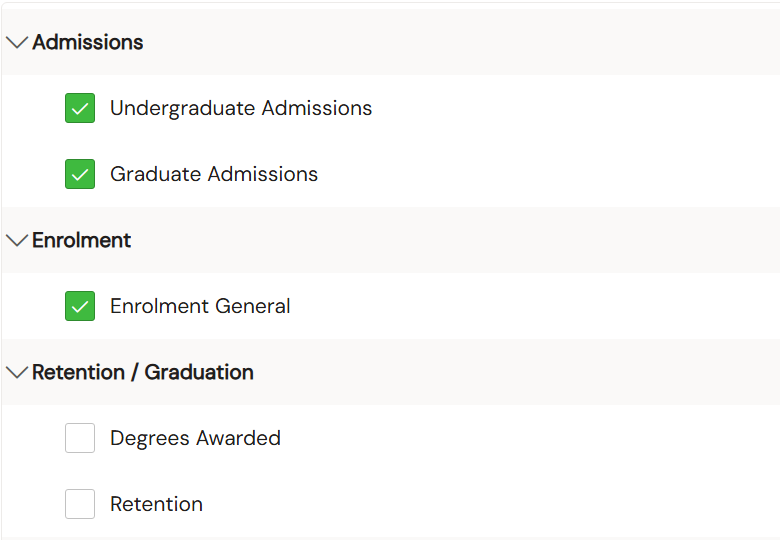

[← Back](/README.html)

## Introduction
I’m Ryan Janvrin, a third-year Computer Science student at the University of Guelph. In the summer of 2026, I had the opportunity to work at the University of Guelph’s Institutional Research and Planning department for my first co-op term for SharePoint Web and Workflow Development. In this report, I’ll talk about some highlights of this position as well as the skills and experience I developed working in this role.  

---

## About the employer
The Office of Institutional Research and Planning acts as the central data hub for the University of Guelph. The department intakes data from a wide variety of sources, creating one of the largest central databases among Ontario universities. The Office of IRP primarily provides departments with access to this data through reports in a central Data Portal. Another focus of IRP is the governance of data. IRP controls who has access to data 

---

## Job Description

 My focus was on the migration of outdated content from a public-facing Drupal site to a modern SharePoint site. The department is changing data storage providers, and is taking this opportunity to improve the Data Portal at the same time. I was responsible for migrating internal materials from the Drupal site to SharePoint as well as cleaning up the Drupal site after content has moved. 

### Data Portal
The Data Portal on the Drupal site was very old, and there were multiple areas with a very bad user experience. The reports were spread across multiple pages in a tree-like structure, sometimes up to 5 levels deep. This made it very difficult for users to even find the report they were looking for. When they found it, they had no idea if they had access until they had gone through a sign-in process for a third-party site. This lead to a very common scenario where a user would search through many pages to find a report, only to find out they are unable to access 

The previous Data Portal also made it difficult for our team to publicize reports. To add a report they would have to create a new page on the Drupal site and manually link to this page in the Data Portal. When there are close to 800 pages on the Drupal site, it is too much work to have to manually manage the Data Portal. 

I used these techniques to improve the user experience:  

- Condensing information spread across pages
  - All of the reports are available through one central catalogue on the SharePoint site. This eliminates the need for page traversal and allows users to see all reports in one page.  
- Displaying access on SharePoint
  - Each report displays whether a user will be able to access the report. This removes the pattern where a user would try to access a report and sign in, only to find out they can't view the report. The framework needed to make this possible has the benefit of requiring one group to manage access, making it easier for IRP to automate access control in the future.  
- Simplifying the process to publish reports
  - The SharePoint site dynamically builds the catalogue from a SharePoint list. Adding a new item to this list will automatically add it to the Data Portal. This requires next to no understanding of the SharePoint framework, greatly reducing the complexity of report publishing.

Improved layout of the Data Portal:  

---

## Goals
This summer, I wanted to make sure I improved my technical and collaborative skills. To track my progress, I set a few goals:  

Improve my collaborative skills by working on projects with others

While working at IRP, I regularly met with management and stakeholders to discuss project expectations and requirements. At these meetings I would share what I'm working on and receive feedback. While working on the Data Portal, I would also meet with project members. After this summer, I feel a lot more confident working on technical projects with others and presenting my work to shareholders and management.

---

Gain experience with automation and Web APIs

While creating the new Data Insights platform, I had the opportunity to use a few web APIs. One goal of the new Data Portal was to display if a user has access to a report before they try to access it. To solve this problem I used an SPFx application using Microsoft Graph's checkMemberGroups API to determine user permissions. The application also uses the SharePoint API to access list data, displaying dynamic content. In addition to APIs, I was able to use Power BI to create multiple automated workflows for tasks, such as custom notifications when forms are submitted. These projects gave me experience with automation and strengthened my ability to design asynchronous programs.

---

Improve my time management and organizational skills

The Drupal site had a large amount of content on it, which made it important to stay organized during the migration. The main tool I used to stay organized was Excel. I mapped out the website to an Excel sheet, and would regularly update this sheet with information as it came along. The sheet acted as a source of truth for content classifications, planned actions, and management decisions. I also improved my time management through the teams planner as well as the calendar. These apps allowed me to allocate my time in both the long term and the short term. This experience will allow me to stay organized when working with large amounts of data.

---

Learn to write clear documentation

One thing that was very important to me during this Co-op was to make sure that others can actually use my work. In pursuit of this, I created multiple step-by-step guides outlining how to update the Data Portal with new content. I believe that simplicity is an important part of documentation; it doesn't matter how clear the documentation is if the task is extremeply complex. I designed the points of interaction with my work to be as simple as possible, using built-in SharePoint features like lists for data input. This work term has changed how I think about documentation and how I expect others to use my work.

---

## Conclusion
I really enjoyed working at the Office of Institutional Research and Planning this summer.   

---

## Acknowledgements
There are a few people who made this work term spectacular, and I'd like to take the time to thank them.